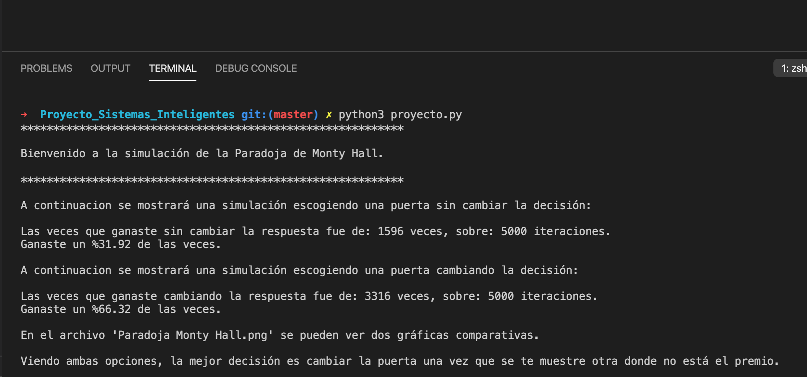

# Paradoja de Monty Hall
El concursante debe elegir una puerta entre tres (todas cerradas); el premio consiste en llevarse lo que se encuentra detrás de la elegida. Se sabe con certeza que tras una de ellas se oculta un automóvil, y tras las otras dos hay cabras. Una vez que el concursante haya elegido una puerta y comunicado su elección a los presentes, el presentador, que sabe lo que hay detrás de cada puerta, abrirá una de las otras dos en la que haya una cabra. A continuación, le da la opción al concursante de cambiar, si lo desea, de puerta (tiene dos opciones). ¿Debe el concursante mantener su elección original o escoger la otra puerta? ¿Hay alguna diferencia?
Esa pregunta generó un intenso debate. Como la respuesta correcta parece contradecir la intuición, es aparentemente una paradoja.

## La solución
Esta solución se basa en tres suposiciones básicas:

* Que el presentador siempre abre una puerta,
* Que tras la que el presentador ha abierto siempre hay una cabra, puesto que conoce lo que hay detrás de cada puerta,
* Que el presentador la escoge entre las dos restantes después de que el concursante haya escogido la suya.

Un estudio probabilístico

El coche tiene una probabilidad de 1/3 de estar detrás de la puerta elegida por el jugador. Las otras dos puertas tienen una probabilidad de 2/3.

Cuando el anfitrión abre una puerta, las probabilidades para los dos conjuntos no cambian, pero las probabilidades se mueven a 0 para la puerta abierta; y 2/3 para la puerta cerrada (2).
La probabilidad de que el concursante escoja en su primera oportunidad la puerta que oculta el coche es de 1/3, por lo que la probabilidad de que el coche se encuentre en una de las puertas que no ha escogido es de 2/3. ¿Qué cambia cuando el presentador muestra una cabra tras una de las otras dos puertas?

Una suposición errónea es que, una vez solo queden dos puertas, ambas tienen la misma probabilidad (es 1/2) de contener el coche. Es errónea ya que el presentador abre la puerta después de la elección del jugador. Esto es, la elección del jugador afecta a la puerta que abre el presentador. No es un suceso aleatorio ni inconexo.

Si el jugador escoge en su primera opción la puerta que contiene el coche (con una probabilidad de 1/3), entonces el presentador puede abrir cualquiera de las otras dos puertas. Además, el jugador pierde el coche si cambia cuando se le ofrece la oportunidad, puesto que había acertado.

Pero, si el jugador escoge una cabra en su primera opción (con una probabilidad de 2/3), el presentador solo tiene la opción de abrir una puerta, y esta es la única puerta restante que contiene una cabra. En ese caso, la puerta restante tiene que contener el coche, por lo que cambiando lo gana, puesto que había elegido cabra en primera opción.

En resumen, si mantiene su elección original gana si escogió originalmente el coche (con probabilidad de 1/3), mientras que si cambia, gana si escogió originalmente una de las dos cabras (con probabilidad de 2/3). Por lo tanto, el concursante debe cambiar su elección si quiere maximizar la probabilidad de ganar el coche.

## Nuestra simulación
En nuestro caso, se hizo una simulación de 5000 juegos, mostrando ambos escenarios, en dónde se analiza por medio de probabilidad, cuál es la mejor decisión. Para esto, se creó un programa usando el lenguaje de programación Python con algunas librerías como numpy y matplotlb.
Para correr el programa solo se necesita descargar el archivo `proyecto.py` y en la consola, usar el comando: `python3 proyecto.py`

## Ejemplo de salida en la terminal

## Ejemplo de gráfica comparativa
